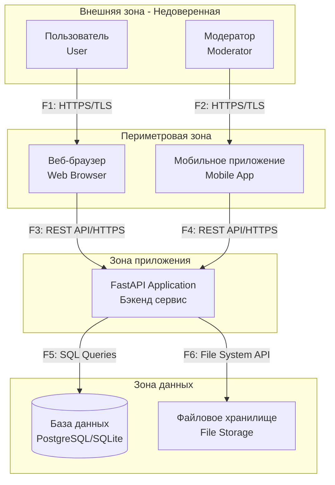

# Data Flow Diagram (DFD) - Suggestion Box System

## Контекстная диаграмма системы

## Список потоков данных

| ID | Откуда → Куда | Протокол/Интерфейс | Данные/PII | Комментарий |
|---|---|---|---|---|
| F1 | User → Web Browser | HTTPS/TLS | Учетные данные, JWT токены | Клиентское соединение |
| F2 | Moderator → Mobile App | HTTPS/TLS | Учетные данные, JWT токены | Клиентское соединение |
| F3 | Web Browser → FastAPI | REST API/HTTPS | JSON данные, API запросы | Внешнее API |
| F4 | Mobile App → FastAPI | REST API/HTTPS | JSON данные, API запросы | Внешнее API |
| F5 | FastAPI → Database | SQL Queries | PII, предложения, метаданные | Взаимодействие с БД |
| F6 | FastAPI → File Storage | File System API | Файлы экспорта, логи | Операции с файлами |
